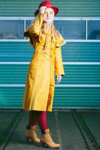

# Multimodal Fashion & Context Retrieval

A hybrid multimodal fashion retrieval system that enables users to search for clothing items using **natural language descriptions**. The system combines **Vision-Language Models (VLMs)**, **semantic embeddings**, **metadata filtering**, and **Cross-Encoder re-ranking** to retrieve visually and contextually relevant fashion images.

---

## Overview

Traditional image retrieval systems rely solely on visual similarity, often failing to capture contextual information such as clothing type, environment, or user intent. This project addresses these limitations by combining structured metadata extraction with semantic vector search.

The retrieval pipeline consists of four stages:

1. **Vision-Language Metadata Extraction**
2. **Metadata-based Filtering**
3. **Semantic Vector Retrieval**
4. **Cross-Encoder Re-ranking**

This hybrid approach significantly improves retrieval accuracy while maintaining efficient search over large fashion datasets.

---

## Features

-  Automatic fashion attribute extraction using Vision-Language Models
-  Environment-aware retrieval (office, beach, rain, park, indoor, etc.)
- Color-aware clothing search
-  Hybrid retrieval using metadata filters and semantic embeddings
-  Fast similarity search using ChromaDB
- Cross-Encoder re-ranking for improved precision
- Modular pipeline for easy experimentation and extension

---

# Project Architecture

```text
                   User Query
                        │
                        ▼
   
                Query Parser (LLM)     
     
                        │
        Hard Filters + Semantic Query
                        │
                        ▼
  
             Metadata Filtering Stage     
     
                        │
                Candidate Images
                        │
                        ▼
         
           SigLIP Vector Similarity    
   
                        │
                Top-k Candidates
                        │
                        ▼
   
          Cross-Encoder Re-ranking      
       
                        │
                        ▼
                 Final Ranked Results
```

---

#  Repository Structure

```text
Fashion-Context-Retrieval/
│
├── data/
│   ├── fashion_dataset/
│
├── experiments/
│   ├── EXP-01.ipynb
│   ├── EXP-02.ipynb
│   └── EXP-03.ipynb
│
├── src/
│   ├── __init__.py
│   ├── indexer.py
│   └── retriever.py
│
├── vector_store/
│
├── main.py
├── requirements.txt
└── README.md
```

---

# Methodology

## Stage 1 — Image Indexing

Each fashion image is processed using a Vision-Language Model to extract structured metadata including:

- Garment type
- Color
- Environment
- Occasion
- Gender
- Clothing attributes

Example metadata:

```json
{
    "top": "yellow raincoat",
    "bottom": "black pants",
    "color": "yellow",
    "environment": "rain",
    "occasion": "casual"
}
```

Metadata is stored alongside vector embeddings inside **ChromaDB**.

---

## Stage 2 — Query Parsing

Natural language queries are converted into structured filters.

Example:

```
A person wearing a yellow raincoat in rainy weather
```

↓

```json
{
    "top": "raincoat",
    "color": "yellow",
    "environment": "rain"
}
```

These extracted attributes are used as **hard filters** before semantic retrieval.

---

## Stage 3 — Semantic Retrieval

After filtering, the remaining images are embedded using a **fashion-tuned SigLIP model**.

Similarity search retrieves the most semantically relevant candidates.

---

## Stage 4 — Cross-Encoder Re-ranking

The retrieved candidates are re-ranked using a Cross-Encoder that jointly evaluates:

- User query
- Candidate image description

This improves ranking quality over cosine similarity alone.

---

# Technologies Used

| Component | Technology |
|------------|------------|
| Programming Language | Python |
| Vision-Language Model | BLIP |
| Image Embeddings | SigLIP |
| Re-ranking | Cross-Encoder |
| Vector Database | ChromaDB |
| Deep Learning | PyTorch |
| Transformers | Hugging Face |
| Notebooks | Jupyter |

---

# Installation

Clone the repository

```bash
git clone https://github.com/subham-28/Fashion-Context-Retrieval.git

cd Fashion-Context-Retrieval
```

Install dependencies

```bash
pip install -r requirements.txt
```

---

#  Running the Project


Run retrieval

```bash
python main.py
```

---

# Example Queries

Below are sample retrieval results produced by the hybrid search pipeline.

| Query | Top Retrieved Images | Best Score |
|------|-----------------------|-----------:|
| **A person in a bright yellow raincoat** |  | **0.0264** |
| **Someone wearing a blue shirt sitting on a park bench** |  | **0.8002** |
| **Professional business attire inside a modern office** |  | **0.3170** |
| **A red tie and a white shirt in a formal setting** |  | **0.0512** |
| **Casual weekend outfit for a city walk** |  | **0.6220** |

---

# Retrieval Pipeline

```text
Images
   │
   ▼
BLIP Captioning
   │
   ▼
Metadata Extraction
   │
   ▼
SigLIP Embeddings
   │
   ▼
ChromaDB
   │
   ▼
User Query
   │
   ▼
LLM Query Parsing
   │
   ▼
Metadata Filtering
   │
   ▼
Vector Similarity Search
   │
   ▼
Cross-Encoder Re-ranking
   │
   ▼
Final Results
```

---

# Current Limitations

### Semantic Synonym Gap

The current metadata filtering relies on exact keyword matching.

Example:

```
Indexed:
Environment = Urban

User Query:
City street
```

Since **city** and **urban** are different tokens, the image may not be retrieved even though they represent the same concept.

---

### Limited Metadata Vocabulary

Only predefined metadata categories are extracted.

More fine-grained attributes like

- sleeve length
- fabric
- texture
- pattern

can further improve retrieval quality.

---

### General-purpose Cross Encoder

The Cross-Encoder is not specifically trained on fashion retrieval tasks.

A fashion-specific fine-tuning could significantly improve ranking performance.

---

# Future Work

- Semantic query expansion using LLMs
- Fashion-specific Cross-Encoder fine-tuning
- Multi-image query support
- Outfit compatibility recommendation
- Visual search using image inputs
- CLIP-based image-to-image retrieval
- Hybrid BM25 + Dense Retrieval
- User relevance feedback loop

---

# References

- BLIP: Bootstrapping Language-Image Pre-training
- SigLIP: Sigmoid Loss for Language Image Pre-training
- ChromaDB Documentation
- Hugging Face Transformers
- Sentence Transformers
- PyTorch

---

# Author

**Subham Mohanty**

B.Tech, Computer Science and Engineering  
International Institute of Information Technology (IIIT) Bhubaneswar

---
